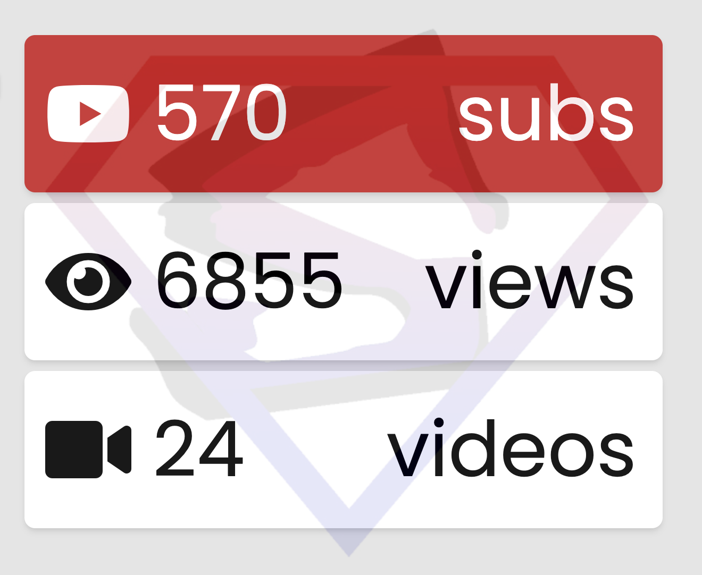

# youtube-stats-page
Very basic YouTube channel statistics page that uses the YouTube Data API v3.

This is heavily based on **John Kormanicki's** code example as found here: https://www.youtube.com/watch?v=pSJPGzSqIJI

I've made the following additions:
* customize the page to show views and video counts as well as the subscriber count
* retrieve the channel logo to show as a watermark
* automatically refresh the stats at a configured interval

## Purpose
This is intended to provide very basic YouTube statistics that's hosted on a low powered device such as a Raspberry Pi with a screen and access to the internet.

## Configuration
To use this you will need to log into the Google Cloud Platform console for your YouTube channel's google account. You will then need to add the YouTube Data API v3 API. Once it's added you then need to generate an API key and ensure you restrict the key to only have access to the YouTube API data v.3. API.

Add the following to app.js:
* API Key
* YouTube Channel ID
* Statistics update interval

**Note:**YouTube seem to update the channel stats slowly, in some cases hours.

## Testing
To test this page, open the index.html locally in a browser.

## Considerations
The page is executed client-side on the browser so **it's not recommended this be published publicly since the API Key would be accessible**.

## Thanks
* John Kormanicki - providing the core code to make this simple page possible
